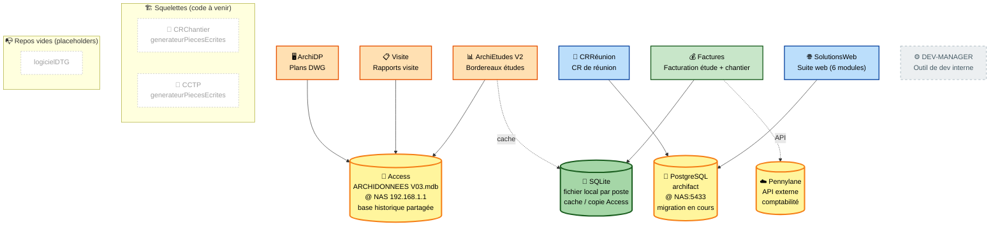
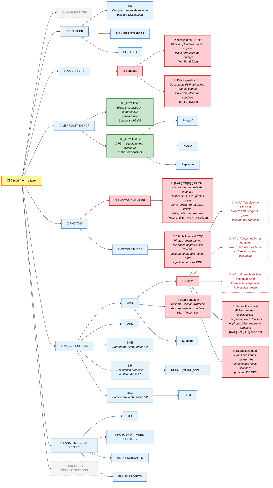
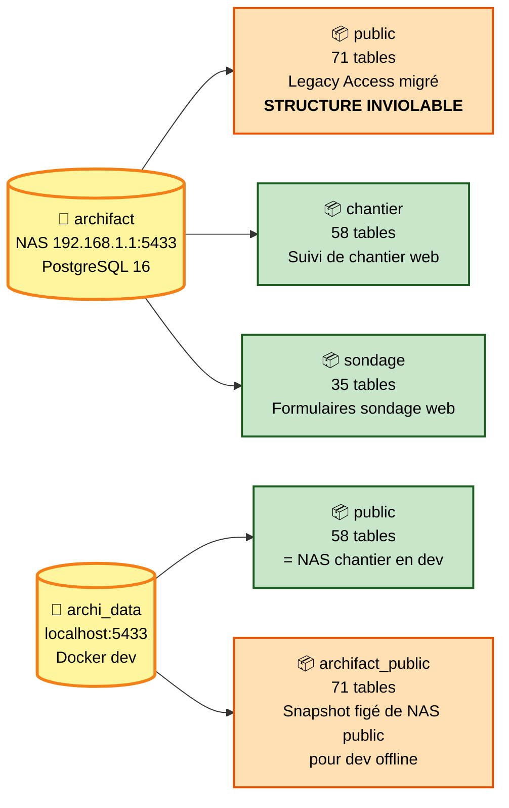

# ArchiGestionV2

Documentation transverse de l'organisation.

## Repos de l'organisation

_Mise a jour : 2026-04-23_

### Modules actifs

| Repo | Type | Description |
|------|------|-------------|
| [SolutionsWeb](https://github.com/ArchiGestionV2/SolutionsWeb) | Web | Suite web (Next.js + FastAPI). Chantier, Sondage, Etude, Repertoires, DTG. Source de verite, deploye sur NAS. |
| [devtoolSharedPyComponents](https://github.com/ArchiGestionV2/devtoolSharedPyComponents) | Package | `archi-shared` — infrastructure partagee desktop (archi_root, archi_db, archi_ui, archi_services). Tag `v1.0.0`. |
| [logicielFiches](https://github.com/ArchiGestionV2/logicielFiches) | Desktop | Traitement de fiches de visite balcons (PySide6, MVVM, OCR Claude). |
| [generateurDWG](https://github.com/ArchiGestionV2/generateurDWG) | Desktop | Generation DWG AutoCAD. Deux sous-modules : Grilles (bordereaux) et Declaration Prealable (cadastre). |

### Repos legacy (non migres, restent dans le monorepo `ArchiFACT-dev/ArchiGestionV2`)

| Module | Raison |
|--------|--------|
| ARCHI'FACTURES | Autonome, pas de dependance partagee |
| DEV-MANAGER | Outil de dev interne |
| Hub | Lanceur central Tkinter |
| ArchiWebManager | Sera remplace par un nouveau systeme |
| Sleeping/ (ArchiAdmin, ArchiCR, ArchiPartiesEcrites, ArchiTradLamy, ArchiWord) | Modules en pause |

### Installation d'un module desktop decouple

```bash
git clone https://github.com/ArchiGestionV2/logicielFiches.git
cd logicielFiches
pip install -r requirements.txt   # installe archi-shared[desktop] depuis Git
cp paths_config.json.example paths_config.json
# Editer paths_config.json avec les chemins locaux (NAS, BDD)
python src/main.py
```

### Repos archives

| Repo | Raison |
|------|--------|
| devtoolSharedWebComponents | Doublon de SolutionsWeb/SharedWebComponents, archive le 2026-04-23 |

---

## Site internet

| Environnement | URL | Utilisateur admin | Mot de passe |
|:---:|---|---|---|
| **Production** | https://architecturalfactory.net | `admin@archifact.fr` | `Archifact2026!` |
| **Développement** | https://dev.architecturalfactory.net | `admin@archifact.fr` | `Archifact2026!` |

Les deux sites partagent la même instance SuperTokens (base `supertokens` sur le NAS).

### Développement du sous-module de création de pièce écrite CR

Le module **SolutionsWeb.Chantier** doit produire les comptes rendus de chantier au format Word/PDF. La documentation de référence pour le mapping entre les signets du template Word et les appels BDD se trouve ici :

- [Mapping Signets CR V2](https://github.com/ArchiGestionV2/SolutionsWeb/blob/main/SolutionsWeb.Chantier/docs/MAPPING_SIGNETS_CR_V2.md) — Mapping signet → fonction DAO, structuré par page template

## Convention de versionnage

Les versions suivent le format **`X.Y.Z`** :

| Composant | Rôle |
|:---:|---|
| **X** | Release stable — changements majeurs |
| **Y** | Ajout d'une fonctionnalité |
| **Z** | Correctif de bug |

**Exemples**

- `1.0.0` — première release stable
- `1.1.0` — ajout d'une feature sur la `1.0.0`
- `1.1.1` — fix d'un bug sur la `1.1.0`
- `2.0.0` — nouvelle release stable (refonte, breaking changes)

---

## Dépendances BDD des modules de la suite 

_Qui tape dans quelle base ? Coup d'œil d'une seconde._



**Légende couleurs** 🟧 orange = base Access · 🟦 bleu = PostgreSQL · 🟩 vert = SQLite local · ⚪ gris pointillé = pas de BDD · ⬜ blanc pointillé = code à venir / repo vide · ☁️ jaune = API externe.

**À retenir**

1. **Access** est la BDD historique partagée par tous les postes (fichier `.mdb` sur le NAS).
2. **PostgreSQL** est la cible de migration — CRRéunion (desktop) et SolutionsWeb (suite web) y sont branchés.
3. **SQLite** sert de cache de session local (ArchiEtudes V2) et de copie convertie d'Access (Factures).
4. **Factures** utilise une copie SQLite de la base Access (conversion offline via `convert_to_sqlite.py`), pas d'accès direct Access. Intégration API Pennylane pour la synchronisation comptable.

---

## Arborescence du dossier NAU

_Structure normalisee du dossier projet sur le NAS. Mise a jour : 2026-04-27 (Sondage + Fiches migres vers arborescence native)._

> **Convention de nommage** : chaque sous-dossier est prefixe par le `NumAffUnique` (ex: `R204D1 DP`). Prefixe omis dans le diagramme pour la lisibilite.



**Legende**

| Style | Signification |
|---|---|
| 🔴 rouge | Dossier ou fichier ecrit automatiquement par un backend SolutionsWeb. Le contenu de chaque noeud decrit ce qui y est stocke et par quel module. |
| 🟩 vert `_ARCHI*` | Dossier d'instance web (legacy, en cours d'abandon). Seuls DP et DTG les utilisent encore. |
| 🟦 bleu | Dossier standard (rempli manuellement ou par des tiers) |
| ⬜ gris pointille | Dossier vide par defaut |
| ⬜ rouge pointille | Fichier individuel (pas un dossier) ecrit par un backend |

### Ecritures NAS par backend

Les backends web ecrivent directement dans l'arborescence native du projet :

**SolutionsWeb.Chantier**

| Contenu | Emplacement | Nommage fichier |
|---------|-------------|-----------------|
| Photos chantier (visite, remarques, tickets, notes manuscrites) | `{NAU} PHOTOS/{NAU} PHOTOS CHANTIER/{NAU} CR{N} ({DD.MM})/` | `{NAU}CR{N}_PHCHANT{X}.jpg` |

> Planning et signatures ont ete supprimes (planning gere en BDD via le Gantt, signatures inutilisees).

**SolutionsWeb.Sondage**

| Contenu | Emplacement | Nommage fichier |
|---------|-------------|-----------------|
| PJ photos formulaires | `{NAU} COURRIERS/{NAU} Sondage/{NAU} Pieces jointes PHOTOS/` | `{lot_matricule}_PJ_{N}.jpg` |
| PJ PDF formulaires | `{NAU} COURRIERS/{NAU} Sondage/{NAU} Pieces jointes PDF/` | `{lot_matricule}_PJ_{N}.pdf` |
| Bilan Excel sondage | `{NAU} PIECES ECRITES/{NAU} APD/{NAU} Bilan Sondage/` | `bilan_{NAU}.xlsx` |

**SolutionsWeb.Fiches**

| Contenu | Emplacement | Nommage fichier |
|---------|-------------|-----------------|
| Template de fiche | `{NAU} PIECES ECRITES/{NAU} APD/{NAU} Fiches/` | `{NAU} Template de fiche.pdf` |
| Fiche rendue par lot | `.../{NAU} Fiches/{NAU} Toutes les fiches/` | `{NAU} Lot {LOT} fiche.pdf` |
| Fusion tout-en-un | `{NAU} PIECES ECRITES/{NAU} APD/{NAU} Fiches/` | `{NAU} Toutes les fiches en un.pdf` |
| Exemplaire imprimable | `{NAU} PIECES ECRITES/{NAU} APD/{NAU} Fiches/` | `{NAU} Exemplaire fiche imprimable.pdf` |
| Extractions manuscrites | `.../{NAU} Fiches/{NAU} Extractions data/` | Convention existante |
| Photos terrain par lot | `{NAU} PHOTOS/{NAU} PHOTOS ETUDES/{NAU} Photos {LOT}/` | Convention existante |

### Dossiers d'instance web (`_ARCHI*`)

Seuls DP et DTG utilisent encore un dossier d'instance :

| Dossier | Backend | Emplacement | Contenu |
|---------|---------|-------------|---------|
| `_ARCHIDP/` | DP | `{NAU} LE PROJET EN PDF/` | Lectures DWG (photos, notes, rapports) |
| `_ARCHIDTG/` | DTG | `{NAU} LE PROJET EN PDF/` | Photos, notes, rapports DTG |

> `_ARCHICHANTIER/`, `_ARCHIFORM/`, `_ARCHIFICHES/` sont vestigiels — leur contenu a ete migre vers l'arborescence native et la BDD. Ils seront supprimes a terme.

**Securite** : le backend Etude (Photo Terrain) navigue librement dans le NAS mais ne peut pas ecrire dans les dossiers `_ARCHI*` (protection `check_not_in_instance_folder`).

**Dossier hors projet** : `_ARCHIDP_EXPORTS/` a la racine du NAS contient les exports cadastraux (captures IGN). Ce dossier n'est pas dans un projet car l'extraction travaille sur des adresses, pas des NAU.

**Creation automatique** : si le parametre admin `auto_create_nau` est active, les backends creent automatiquement le dossier NAU avec son arborescence quand un projet est accede pour la premiere fois.

> **Modules desktop** : les modules desktop (ArchiDP, ArchiEtudes, CRReunion) ne codent pas en dur ces chemins. Les utilisateurs les pointent par convention au moment du run.

> **Visite** n'apparait dans aucune case : ses sorties vont dans `\192.168.1.1\Travail\TRAVAIL\TRAVAIL\VISITE CONSEIL\` — hors de l'arborescence NAU.

> **Niveau 3** : la plupart des sous-sous-sous-dossiers (comme `DEPOT JANVIER 2026/`, `Cage d'escalier/`, etc.) sont ad-hoc selon le projet. Seuls les patterns recurrents sont montres.
---

## Tables BDD utilisées par module

_Inventaire factuel des tables lues et/ou écrites par chaque module._

Code : **R** = lecture · **W** = écriture (INSERT / UPDATE / DELETE) · **S** = évolution de schéma (CREATE / ALTER TABLE) · **dyn** = table choisie dynamiquement selon le préfixe du NumAffUnique.

<details>
<summary>🖥️ <b>ArchiDP</b> — 100 % lecture (Access)</summary>

Aucune écriture en BDD. Interroge Access pour pré-remplir le wizard à partir du `NumAffUnique`.

| Table | Op. | Usage |
|---|:-:|---|
| `DP` | R | données cadastrales : `RefCadastrale`, `SurfaceParcelle`, `NbEtages` |
| `RAVALEMENT` / `COPROPRIETE` / `HABITATION` / `BUREAUX` / `DIAGNOSTIC` / `VISITECONSEIL` | R (dyn) | la première lettre du NAU choisit la table. Lecture de `OBJETTRAVAUX`, `ADRESSECHANTIER`, `CPCHANTIER`, `VILLECHANTIER` |

Fichier clé : `ui/workers/access_fetcher.py`

</details>

<details>
<summary>📋 <b>Visite</b> — 4 tables en R+W (Access)</summary>

Seul module avec écriture lourde en BDD partagée. Crée la visite, les intervenants, les remarques et les photos.

| Table | Op. | Usage |
|---|:-:|---|
| `VISITECONSEIL` | R+W | `INSERT` nouvelle visite (NumAffUnique = `V{N}D1`), `SELECT` pour charger, `UPDATE` colonnes `Intervenant01..08` et `Int0NPresence` |
| `INTERVENANTS` | R+W | `SELECT` MO (`Fonction='MO' AND Titre='Gestionnaire'`), `INSERT` nouveaux intervenants rattachés à l'affaire (via `Fonction` = NumAffUnique) |
| `REMARQUES` | R+W | `SELECT MAX(NumTitre)` / `MAX(NumRemarque)`, `INSERT` nouveaux titres et remarques, `UPDATE` ordre |
| `PHOTOS` | R+W | `SELECT MAX(NumPhoto)`, `INSERT` nouvelle photo, `UPDATE LegendePhoto` |

Fichier clé : `core/db_access.py`

</details>

<details>
<summary>📝 <b>CRRéunion</b> — 100 % lecture (PostgreSQL)</summary>

Aucune écriture en BDD. Pure consultation du projet via son NAU.

| Table | Op. | Usage |
|---|:-:|---|
| `ravalement` / `copropriete` / `habitation` / `bureaux` | R (dyn) | choix par préfixe NAU. Lecture de `objettravaux`, `adressechantier`, `cpchantier`, `villechantier`, `numpropo`, `intervenantmo` |
| `intervenants` | R | enrichissement `genre` et `raisonsociale` du MO |

Fichier clé : `core/db_access.py`

</details>

<details>
<summary>📊 <b>ArchiEtudes V2</b> — 10 tables Access + 2 SQLite</summary>

Seul module à faire de l'évolution de schéma en prod. Gère DQE, questionnaire, descriptif, propositions, planning.

**Access (`ARCHIDONNEES V03.mdb`)**

| Table | Op. | Usage |
|---|:-:|---|
| `AE DQE` | R+W+S | bordereaux DQE, versioning. `ALTER TABLE ADD COLUMN [Version] TEXT(10)` si absente |
| `AE QUESTIONNAIRE SIMPLIFIE` | R+W+S | questionnaire hiérarchique (Item1→Item2→Item3). `ALTER TABLE ADD COLUMN [Lien{N}] MEMO` à la volée |
| `CHANTIER` | R | `AdresseChantierComplete` par NumAffUnique |
| `INTERVENANTS` | R | recherche par `NOM` ou `RAISONSOCIALE` |
| `PROPOSITIONS` | R+W | liste des propositions, `UPDATE [ETAT]` par NUMPROPO |
| `RAVALEMENT` | R+W | création via `MAX(NUMDOSSIER)+1` + `INSERT`, `UPDATE` par REFAFF, champs date et état |
| `COPROPRIETE` | R+W | idem pour affaires type C |
| `HABITATION` / `BUREAUX` | R+W (dyn) | opérations génériques via `{table}` variable (fuite par préfixe NAU) |
| `DESCRIPTIF` | R+W | descriptifs, lots, sous-lots. CRUD complet (`SELECT`, `INSERT`, `UPDATE`, `DELETE`) |
| `PlanningDossier` | R+W+S | planning. `CREATE TABLE PlanningDossier (...)` si absente (auto-init) |
| `TauxTVABORDEREAU` | R | `SELECT TOP 1 [{col}] ORDER BY ID DESC` |

**SQLite local (cache de session, 1 fichier par poste)**

| Table | Op. | Usage |
|---|:-:|---|
| `meta` | R+W+S | métadonnées session (clé/valeur). `CREATE TABLE IF NOT EXISTS meta` |
| `entries` | R+W+S | paires `(section, key, value)` — cache formulaire. `INSERT ... ON CONFLICT ... DO UPDATE` |

Fichiers clés : `database/connection.py`, `database/session_cache.py`, `database/repositories/*.py`

</details>

<details>
<summary>💰 <b>Factures</b> — 6 tables SQLite (copie Access) + API Pennylane</summary>

Application desktop PyQt6 de facturation étude et chantier. Travaille sur une **copie SQLite** de la base Access (convertie via `convert_to_sqlite.py`), pas d'accès Access direct.

**SQLite local (`database_v2.sqlite` — copie de ARCHIDONNEES V03)**

| Table | Op. | Usage |
|---|:-:|---|
| `FACTURATION` | R+W | CRUD factures : `NumeroFacture`, `NumAffUnique`, `NumeroOS`, `MontantHT`, `TxAvancement`, `DateEmission`, `DatePaiement`, `Notes` (tags `#EP#`, `#SITUATION#`, etc.) |
| `COPROPRIETE` | R (dyn) | infos affaire : `IntervenantMO`, `OBJETTRAVAUX`, `ADRESSECHANTIER`, `CPCHANTIER`, `VILLECHANTIER` |
| `RAVALEMENT` | R (dyn) | idem pour affaires type R |
| `INTERVENANTS` | R | `RaisonSociale`, `Nom`, `Adresse`, `CP`, `Ville`, `FormeSociale` |
| `OS` | R | ordres de service : `NumeroOS`, `NumAffUnique`, `MontantDevis`, `DateOS`, `TVATxReduit` |
| `PROPOSITIONS` | R | montants par étape : `MontantEtudesPrealables`, `MontantAPD`, `MontantDCERAO`, `MontantDP` |

**API externe (Pennylane)**

Synchronisation des factures vers la comptabilité (création brouillons, envoi). Token API dans `config.yaml` (exclu du repo).

Fichiers clés : `database/connection.py`, `database/repositories/*.py`, `services/pennylane_api.py`

</details>

### Points clés

- **INTERVENANTS (Access)** est partagée en écriture par Visite seulement → risque de contention minime mais à surveiller si plusieurs utilisateurs saisissent simultanément.
- **`VISITECONSEIL`** est lue par ArchiDP et écrite par Visite — Visite crée le dossier, ArchiDP le lit plus tard pour enrichir son wizard.
- **ArchiEtudes V2** modifie le schéma Access en production (ALTER TABLE, CREATE TABLE) — pratique risquée : un conflit de verrou peut bloquer tous les postes. Candidat pour une vraie couche de migration versionnée.
- **CRRéunion** est le seul sur PG, en lecture pure. La migration PG n'écrit rien à ce stade.
- **Factures** ne touche pas Access directement — il travaille sur une copie SQLite convertie offline. Pas de risque de contention Access, mais la copie peut devenir obsolète si la base Access évolue.

---

## Carte PostgreSQL — schémas et tables

_État des lieux de la base PostgreSQL `archifact` sur le NAS (192.168.1.1:5433)._

### Vue d'ensemble



### Deux instances, trois schémas

| Instance | Schéma | Tables | Rôle | Accès |
|---|---|--:|---|---|
| **NAS** `archifact` | `public` | 71 | Legacy du cabinet (miroir Access). **Structure inviolable** — aucun ALTER/CREATE/DROP. Contenu éditable via UI uniquement. | R+W (contenu) |
| **NAS** `archifact` | `chantier` | 58 | Tables métier du suivi de chantier web (CR, tickets, remarques, photos, planning…) | R+W+S |
| **NAS** `archifact` | `sondage` | 35 | Tables métier des formulaires sondage web (projets, lots, réponses, emails…) | R+W+S |
| **Local** `archi_data` | `public` | 58 | Copie de travail du schéma `chantier` NAS (dev quotidien) | R+W+S |
| **Local** `archi_data` | `archifact_public` | 71 | Snapshot figé de `public` NAS pour dev offline | R seul |

> **`PG_SCHEMA`** : variable d'environnement qui pilote le `search_path` au runtime. En prod NAS → `chantier,public`. En dev local → vide (tout dans `public`).

---

### Schéma `public` — Legacy (71 tables)

Tables migrées depuis Access (`ARCHIDONNEES V03.mdb`). Noms historiques conservés tels quels.

<details>
<summary>📋 <b>Affaires et dossiers</b> (8 tables)</summary>

| Table | Description |
|---|---|
| `ravalement` | Dossiers ravalement (type R) |
| `copropriete` | Dossiers copropriété (type C) |
| `habitation` | Dossiers habitation (type H) |
| `bureaux` | Dossiers bureaux (type B) |
| `diagnostic` | Dossiers diagnostic |
| `visiteconseil` | Dossiers visite conseil (type V) |
| `etude` | Dossiers étude |
| `chantier` | Dossiers chantier (adresses, intervenants MO) |

</details>

<details>
<summary>👥 <b>Intervenants et personnel</b> (4 tables)</summary>

| Table | Description |
|---|---|
| `intervenants` | Répertoire des intervenants (entreprises, MO, BET…) |
| `personnel` | Personnel du cabinet |
| `crpresence` | Présences en réunion |
| `infosagence` | Informations de l'agence |

</details>

<details>
<summary>📊 <b>Bordereaux et études</b> (12 tables)</summary>

| Table | Description |
|---|---|
| `chainblockbordereau` | Chaîne de blocs bordereau (données encodées CB3) |
| `descriptif` | Descriptifs de travaux |
| `descriptif copie` | Copie de travail des descriptifs |
| `descriptif old` | Anciens descriptifs |
| `descriptifbordereau` | Liaison descriptif ↔ bordereau |
| `descriptifliste` | Listes de descriptifs |
| `descriptiflocalisation` | Localisation dans les descriptifs |
| `descriptiflot` | Lots dans les descriptifs |
| `propositions` | Propositions commerciales |
| `os` | Ordres de service |
| `tauxtva` | Taux de TVA |
| `tauxtvabordereau` | TVA par bordereau |

</details>

<details>
<summary>📸 <b>Photos et remarques</b> (4 tables)</summary>

| Table | Description |
|---|---|
| `photos` | Photos de visite |
| `remarques` | Remarques de visite |
| `remarquesdossiers` | Dossiers de remarques |
| `illustrations` | Illustrations |

</details>

<details>
<summary>💰 <b>Facturation</b> (4 tables)</summary>

| Table | Description |
|---|---|
| `facturation` | Factures émises |
| `facturationmodele` | Modèles de facturation |
| `facturationpb` | Facturation problèmes |
| `factfourni` | Factures fournisseurs |

</details>

<details>
<summary>📝 <b>Déclaration préalable</b> (1 table)</summary>

| Table | Description |
|---|---|
| `dp` | Données cadastrales (RefCadastrale, SurfaceParcelle, NbEtages) |

</details>

<details>
<summary>🏢 <b>DTG — Diagnostic Technique Global</b> (18 tables)</summary>

| Table | Description |
|---|---|
| `dtg` | Dossiers DTG |
| `dtgbatiment` | Bâtiments DTG |
| `dtgchaufferie` | Chaufferies |
| `dtgchaufferieobligation` | Obligations chaufferie |
| `dtgclécharge` | Clés de charge |
| `dtgcontexte` | Contexte DTG |
| `dtgcontrat` | Contrats |
| `dtgfiche` | Fiches DTG |
| `dtgficheliste` | Listes de fiches |
| `dtgfichetheme` | Thèmes de fiches |
| `dtggestiontech` | Gestion technique |
| `dtgitem` | Items DTG |
| `dtgnotion01` | Notions DTG |
| `dtgplu` | PLU |
| `dtgpropo` | Propositions DTG |
| `dtgpropoliste` | Listes de propositions |
| `dtgrcpinhabituel` | RCP inhabituels |
| `dtgreferences` | Références DTG |
| `dtgssi` | SSI DTG |
| `dtgtravaux` | Travaux DTG |

</details>

<details>
<summary>⚙️ <b>Divers et système</b> (20 tables)</summary>

| Table | Description |
|---|---|
| `ccap` | CCAP |
| `diagbase` | Base diagnostic |
| `diagphoto` | Photos diagnostic |
| `fiches` | Fiches génériques |
| `gerer` | Gestion 1 |
| `gerer2` | Gestion 2 |
| `infoconnection` | Infos de connexion |
| `messages` | Messages internes |
| `partieecritequestions` | Questions pièces écrites |
| `partieecritequestions 2` | Questions pièces écrites (copie) |
| `partieecritequestions copie` | Questions pièces écrites (autre copie) |
| `planning` | Planning |
| `pppt` | PPPT |
| `pv` | Procès verbaux |
| `pvreserves` | Réserves PV |
| `table des erreurs` | Table d'erreurs |
| `trello` | Intégration Trello |
| `type` | Types |

</details>

---

### Schéma `chantier` — Suivi de chantier web (58 tables)

Tables créées et gérées par **SolutionsWeb.Chantier** et **SolutionsWeb.Sondage**. Structure modifiable.

<details>
<summary>📝 <b>Comptes rendus et tickets</b> (11 tables)</summary>

| Table | Description |
|---|---|
| `comptes_rendus` | CR de chantier (machine à états : actif → cr0_validé) |
| `tickets` | Remarques/observations par CR |
| `ticket_photos` | Photos rattachées aux tickets |
| `titres` | Titres/sections des CR |
| `remarques` | Remarques spécifiques |
| `remarque_photos` | Photos de remarques |
| `presences` | Présences en réunion de chantier |
| `lot_avancements` | Avancements par lot |
| `lot_sections` | Sections de lots |
| `suivi_entries` | Entrées de suivi |
| `project_signatures` | Signatures projet |

</details>

<details>
<summary>🏗️ <b>Configuration chantier</b> (7 tables)</summary>

| Table | Description |
|---|---|
| `chantier_config` | Configuration par projet (toggle actif, préférences) |
| `chantier_intervenants` | Intervenants rattachés au chantier |
| `intervenant_sections` | Sections par intervenant |
| `lots` | Lots de travaux (FK → chantier_intervenants) |
| `ordres_service` | Ordres de service normalisés |
| `ordres_service_lots` | Pivot N↔N : OS ↔ lots |
| `rdv_chantier` | Rendez-vous de chantier |

</details>

<details>
<summary>📊 <b>Bordereaux</b> (3 tables)</summary>

| Table | Description |
|---|---|
| `bordereaux` | Bordereaux de travaux |
| `bordereau_lots` | Lots par bordereau |
| `bordereau_postes` | Postes par bordereau |

</details>

<details>
<summary>📷 <b>Photos</b> (3 tables)</summary>

| Table | Description |
|---|---|
| `visite_photos` | Photos de visite terrain |
| `portrait_slots` | Emplacements portraits |

</details>

<details>
<summary>📋 <b>Formulaires sondage</b> (35 tables)</summary>

Partagées entre `chantier` et `sondage` (même structure, schéma différent).

| Table | Description |
|---|---|
| `form_projets` | Projets de sondage |
| `form_definitions` | Définitions de formulaires |
| `form_config` | Configuration formulaires |
| `form_batiments` | Bâtiments |
| `form_batiment_groups` | Groupes de bâtiments |
| `form_batiment_typologies` | Typologies de bâtiments |
| `form_lots` | Lots de sondage |
| `form_lot_equipements` | Équipements par lot |
| `form_lot_fenetres` | Fenêtres par lot |
| `form_lot_historique` | Historique des lots |
| `form_lot_pieces_jointes` | Pièces jointes par lot |
| `form_responses` | Réponses aux formulaires |
| `form_response_validations` | Validations de réponses |
| `form_tokens` | Tokens d'accès formulaires |
| `form_send_lists` | Listes d'envoi |
| `form_email_queue` | File d'attente emails |
| `form_email_templates` | Templates d'emails |
| `form_processed_emails` | Emails traités par le collecteur |
| `form_unidentified_emails` | Emails non identifiés |
| `form_syndics` | Syndics |
| `form_coproprietaires` | Copropriétaires |
| `form_attachments` | Pièces jointes formulaires |
| `form_disputed_items` | Éléments contestés |
| `form_typologies` | Typologies de fenêtres |
| `form_types_equipements` | Types d'équipements |
| `form_types_fenetres` | Types de fenêtres |
| `form_equipment_categories` | Catégories d'équipements |
| `form_equipment_templates` | Templates d'équipements |
| `form_category_characteristics` | Caractéristiques par catégorie |
| `form_characteristic_values` | Valeurs de caractéristiques |
| `form_project_categories` | Catégories par projet |
| `form_registry_suggestions` | Suggestions de registre |
| `internal_surveys` | Sondages internes |
| `internal_survey_assignments` | Affectations sondages internes |
| `internal_survey_responses` | Réponses sondages internes |

</details>

---

### Schéma `sondage` — Formulaires sondage web (35 tables)

Même structure de 35 tables `form_*` et `internal_*` que dans `chantier` ci-dessus. Schéma dédié pour isoler les données sondage des données chantier en production.

---

### Environnement de dev local (`archi_data`)

| Schéma | Contenu | Mise à jour |
|---|---|---|
| `public` | 58 tables = copie de `chantier` NAS | Dev quotidien, diverge du NAS |
| `archifact_public` | 71 tables = snapshot de `public` NAS | Script `scripts/snapshot_nas_public_to_local.py` — figé, relancé manuellement |

> **Pourquoi deux instances ?** Le dev local sur Docker permet de travailler sans dépendance réseau au NAS. Le snapshot `archifact_public` fournit les données de référence legacy (intervenants, affaires) nécessaires aux jointures.
